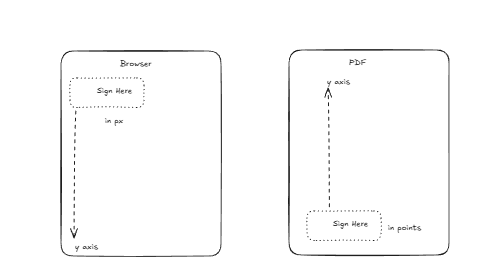

# PDF Editor & Manager

A full-stack web application for uploading, viewing, and editing PDF documents. This project leverages a modern tech stack with a React frontend and an Express backend, utilizing specialized libraries for PDF manipulation.

## 🚀 Features

- **PDF Viewing**: High-fidelity PDF rendering using `react-pdf` and `pdfjs-dist`.
- **Interactive Editing**: Add annotations, text, and shapes to PDFs using `fabric` (Fabric.js).
- **Drag & Drop Uploads**: seamless file upload interface using `react-dropzone`.
- **Backend Processing**: Robust PDF handling on the server with `pdf-lib` and `sharp`.
- **Database Storage**: Metadata and file references stored in MongoDB.
- **Responsive Design**: Built with `tailwindcss` for a modern, responsive UI.

## 🛠️ Tech Stack

### Client
- **Framework**: React (Vite)
- **Styling**: TailwindCSS, Radix UI, Lucide React
- **PDF/Canvas**: React-PDF, Fabric.js
- **State Management**: Zustand
- **Routing**: React Router

### Server
- **Runtime**: Node.js
- **Framework**: Express
- **Database**: MongoDB (Mongoose)
- **File Handling**: Multer, PDF-Lib, Sharp, UUID

## 📦 Prerequisites

Ensure you have the following installed on your machine:
- [Node.js](https://nodejs.org/) (v16 or higher recommended)
- [MongoDB](https://www.mongodb.com/) (Local instance or Atlas URI)
- [pnpm](https://pnpm.io/) (Recommended) or npm/yarn

## 🔧 Installation & Setup

1. **Clone the repository**
   ```bash
   git clone <repository_url>
   cd boloforms
   ```

2. **Setup Server**
   ```bash
   cd server
   npm install
   # or
   pnpm install
   ```
   *Note: Ensure you have a `.env` file in the server directory if required (e.g., for MONGODB_URI).*

3. **Setup Client**
   ```bash
   cd ../client
   npm install
   # or
   pnpm install
   ```

## 🏃‍♂️ Running the Application

**Run Server:**
Open a terminal in the `server` directory:
```bash
npm run dev
# This will start the server using nodemon
```

**Run Client:**
Open a new terminal in the `client` directory:
```bash
npm run dev
# This will start the Vite development server
```

The client usually runs at `http://localhost:5173` and the server on a defined port (defaulting often to 3000 or 5000).

## 📄 License

This project is licensed under the ISC License.

## 📐 Coordinate System & Pixel Logic

The PDF Signature Injection Engine uses a three-tier coordinate system to ensure fields appear correctly across all devices and are accurately burned into the final PDF.

### The Problem
We need to handle **three different coordinate systems**:



| System | Origin | Y Direction | Units | Used By |
|--------|--------|-------------|-------|---------|
| Browser | Top-left | Down ↓ | CSS pixels | Fabric.js canvas |
| Normalized | Top-left | Down ↓ | 0-1 ratio | Storage/API |
| PDF | **Bottom-left** | Up ↑ | Points (72/inch) | pdf-lib |

### 1. User Places a Field (Browser Pixels)
When a user clicks on the canvas, we get pixel coordinates (e.g., `x: 150`, `y: 200` on a 600x800 canvas).


### 2. Convert to Normalized Coordinates (0-1)
We store coordinates as **normalized values** so they work on any screen size.

```typescript
// client/src/types/field-types.ts
export function pixelToNormalized(pixelX, pixelY, pixelWidth, pixelHeight, canvasWidth, canvasHeight) {
  return {
    x: pixelX / canvasWidth,        // 150/600 = 0.25 (25% from left)
    y: pixelY / canvasHeight,       // 200/800 = 0.25 (25% from top)
    width: pixelWidth / canvasWidth, // 120/600 = 0.20
    height: pixelHeight / canvasHeight, // 32/800 = 0.04
  };
}
```

### 3. Transform to PDF Points (Backend)
When burning fields, we transform normalized coords to **PDF points** with a **Y-axis flip** (since PDF origin is bottom-left).

```typescript
// server/src/services/pdf-processor.ts
// Standard Letter PDF: 612pt × 792pt

const pdfX = field.x * pageWidth;       // 0.25 * 612 = 153pt
const pdfWidth = field.width * pageWidth;  
const pdfHeight = field.height * pageHeight; 

// CRITICAL: Flip Y-axis
// pdfY = pageHeight - (normalizedY * pageHeight) - fieldHeight
const pdfY = pageHeight - (field.y * pageHeight) - pdfHeight;
```

